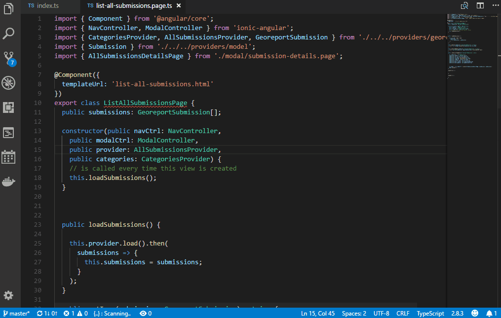

# vscode-journal README

Lightweight Extension for Visual Studio Code to take track of your daily notes.  

## What's this about?
This extension is only useful for people like me, who use simple text files for notes, task lists, and everything else which has to be remembered and searched for. Textfiles are easy to backup, sync and can be opened anywhere by everything. This extension has the following functions: 

* Open or create a journal entries for a specific day ([details and videos](./docs/entries.md))
* Add detailed notes for today ([details and videos](./docs/notes.md))
* Add a memo to today's journal page ([details and videos](./docs/memo.md))
* Manage your tasks ([details and videos](./docs/tasks.md))

## Features
Press `F1` or `Ctrl+Shift+P` to access one of the  commands. All supported commands are described ([here](./docs/commands.md)) 
Press `Ctrl+Shift+J` to open the journal's smart input and start typing right away. 

The notes are stored in a folder on your pc using the following structure (taking ZIM Desktop wiki as inspiration: `year/month/day.md`, the notes files for October 22th would be `../2016/10/22.md`. Detailed notes (e.g. meeting notes) are placed in the subfolder `../2016/10/22/some-meeting-notes.md`. (soon: will be configurable)

## Settings
You have to set the base folder for notes folder structure before you start. Open your settings, search for 'journal' and copy the journal.base line into your personal settings. Adjust the value, for example: ` "journal.base": "C:/Users/FooBar/Documents/Journal"` (use forward slash!)

The default file format is Markdown (using `md` as extension), which is natively supported by Visual Studio Code. I use Asciidoc for my notes (with `.adoc` as extension), in this case you should also install an Asciidoc Syntax extension. 

Syntax highlighting is configured in your workspace settings. The options are stored automatically in the settings, you can then manually change them. Make sure to restart to apply the changes. The settings try to recognize 

## Demo

